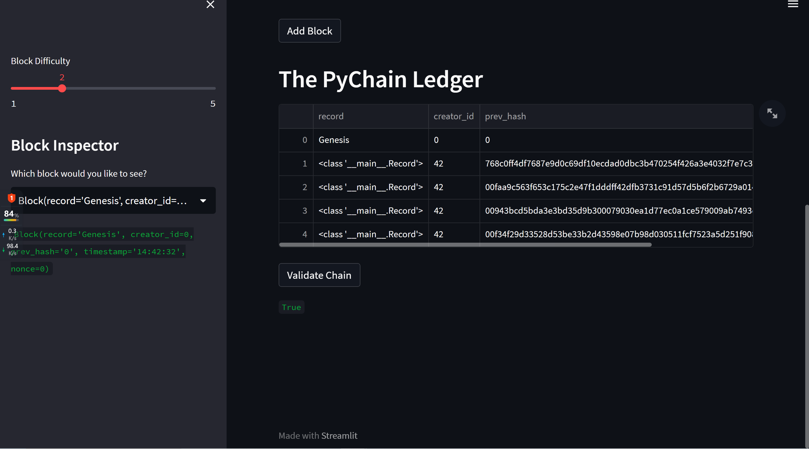
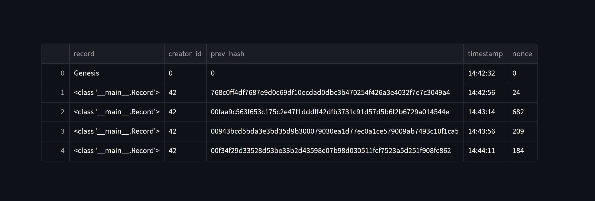

# Module18 PyChain Ledger
## Functionality
the `PyChain` ledger that we built includes the functionality to create blocks, perform the proof of work consensus protocol, and validate blocks in the chain.

## Process
The specific steps included in the construction process are as below:

1. Create a Record Data Class

2. Modify the Existing Block Data Class to Store Record Data

3. Add Relevant User Inputs to the Streamlit Interface

4. Test the PyChain Ledger by Storing Records

## Result
We successfully employed the streamlit application and created a pychain ledger that takes in several different inputs.

As we can see, different inputs generated differnt hash codes. By altering the amount and difficulty, we were also able to attain hash codes of different lengths.
